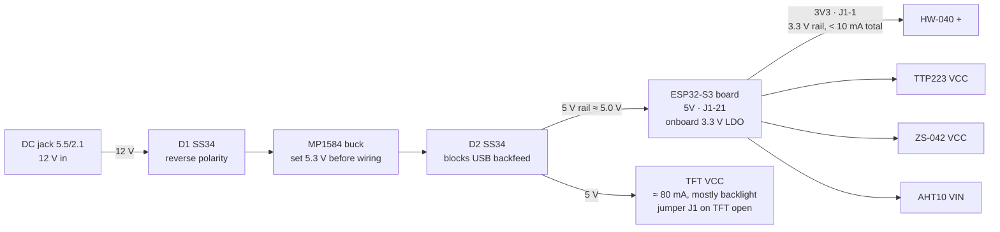

# Monolith HMI Wiring

**ESP32-S3 HMI · tilted "Monolith" enclosure**

This sheet lists every connection for the ESP32-S3 N16R8 board, the 2.8" ILI9341 touch display, the HW-040 encoder, the TTP223 touch key, the ZS-042 RTC, the AHT10 and the 12 V supply. The GPIOs were chosen to avoid the board's reserved pins and to keep wire crossings to a minimum.

## Signal wiring

The wiring is listed module by module. Power pins (3V3, 5V and GND) go to the rails described in [Power](#power).

### 2.8" TFT MSP2807 (ILI9341 + XPT2046 touch)

The display and the touch controller share one SPI bus on GPIO 11/12/13, which are the S3's fast IO_MUX pins.

| Module pin | ESP32-S3 | Notes |
|---|---|---|
| VCC | 5V rail | |
| GND | GND | |
| CS | GPIO15 | |
| RESET | GPIO17 | |
| DC | GPIO18 | |
| SDI (MOSI) | GPIO11 | shared with T_DIN |
| SCK | GPIO12 | shared with T_CLK |
| LED | GPIO9 | backlight PWM |
| SDO (MISO) | — | **leave unconnected** (see note 4) |
| T_CLK | GPIO12 | shared with SCK |
| T_CS | GPIO10 | |
| T_DIN | GPIO11 | shared with SDI |
| T_DO | GPIO13 | |
| T_IRQ | GPIO14 | |

### HW-040 rotary encoder

| Module pin | ESP32-S3 |
|---|---|
| CLK | GPIO4 |
| DT | GPIO5 |
| SW | GPIO6 |
| + | 3V3 rail |
| GND | GND |

### TTP223 touch key

| Module pin | ESP32-S3 |
|---|---|
| I/O | GPIO16 |
| VCC | 3V3 rail |
| GND | GND |

### ZS-042 RTC (DS3231), I²C bus 0

| Module pin | ESP32-S3 |
|---|---|
| 32K | — (leave unconnected) |
| SQW | GPIO1 |
| SCL | GPIO2 |
| SDA | GPIO42 |
| VCC | 3V3 rail |
| GND | GND |

### AHT10, I²C bus 1

| Module pin | ESP32-S3 |
|---|---|
| VIN | 3V3 rail |
| GND | GND |
| SCL | GPIO41 |
| SDA | GPIO40 |

### Board header order (top view)

The headers are listed with the antenna end at the top and the USB-C ports at the bottom. ~~Struck-through~~ pins are reserved on this board, so don't use them.

| # | J1 (left) | Use | J3 (right) | Use |
|---|---|---|---|---|
| 1 | 3V3 | 3.3 V rail | GND | GND |
| 2 | 3V3 | 3.3 V rail | ~~43 TX~~ | UART0 |
| 3 | RST | — | ~~44 RX~~ | UART0 |
| 4 | GPIO4 | Encoder CLK | GPIO1 | RTC SQW |
| 5 | GPIO5 | Encoder DT | GPIO2 | RTC SCL |
| 6 | GPIO6 | Encoder SW | GPIO42 | RTC SDA |
| 7 | GPIO7 | *free* | GPIO41 | AHT10 SCL |
| 8 | GPIO15 | TFT CS | GPIO40 | AHT10 SDA |
| 9 | GPIO16 | TTP223 I/O | GPIO39 | *free* |
| 10 | GPIO17 | TFT RESET | GPIO38 | *free* |
| 11 | GPIO18 | TFT DC | ~~GPIO37~~ | PSRAM |
| 12 | GPIO8 | *free* | ~~GPIO36~~ | PSRAM |
| 13 | ~~GPIO3~~ | strapping | ~~GPIO35~~ | PSRAM |
| 14 | ~~GPIO46~~ | strapping | ~~GPIO0~~ | strapping |
| 15 | GPIO9 | TFT LED | ~~GPIO45~~ | strapping |
| 16 | GPIO10 | T_CS | GPIO48 | *free* (onboard RGB LED) |
| 17 | GPIO11 | MOSI | GPIO47 | *free* |
| 18 | GPIO12 | SCK | GPIO21 | *free* |
| 19 | GPIO13 | MISO (T_DO) | ~~GPIO20~~ | native USB |
| 20 | GPIO14 | T_IRQ | ~~GPIO19~~ | native USB |
| 21 | 5V | 5 V rail | GND | GND |
| 22 | GND | GND | GND | GND |

## Power



12 V comes in through D1, which protects against reverse polarity. The MP1584 steps it down, and D2 feeds the 5 V rail. D2 drops about 0.3 V, so set the buck to 5.3 V. The display runs from 5 V through its own regulator. All the small modules run from the ESP32 board's 3.3 V pin, so every signal into the ESP32 stays at 3.3 V.

- **Load at 5 V:** ESP32-S3 Wi-Fi peaks at about 0.5 A, plus about 0.08 A for the TFT, for a total under 0.7 A. That is about 0.35 A from the 12 V supply.
- **Ground:** buck OUT− goes to the board's GND pin (J1-22). Every module GND returns to the ESP32 board's GND pins, which act as the star point.

## Pin map

| GPIO | Header | Function | Module pin |
|---|---|---|---|
| **Display + touch (SPI)** | | | |
| 11 | J1-17 | MOSI | TFT SDI (MOSI) + T_DIN |
| 12 | J1-18 | SCK | TFT SCK + T_CLK |
| 13 | J1-19 | MISO | T_DO only (TFT SDO open) |
| 15 | J1-8 | TFT_CS | TFT CS |
| 17 | J1-10 | TFT_RST | TFT RESET |
| 18 | J1-11 | TFT_DC | TFT DC |
| 9 | J1-15 | Backlight PWM | TFT LED |
| 10 | J1-16 | TOUCH_CS | T_CS |
| 14 | J1-20 | TOUCH_IRQ (low = pressed) | T_IRQ |
| **Controls** | | | |
| 4 | J1-4 | Encoder A | HW-040 CLK |
| 5 | J1-5 | Encoder B | HW-040 DT |
| 6 | J1-6 | Encoder push (low = pressed) | HW-040 SW |
| 16 | J1-9 | Back key (high = touched) | TTP223 I/O |
| **I²C bus 0 · RTC** | | | |
| 42 | J3-6 | SDA | ZS-042 SDA (0x68, EEPROM 0x57) |
| 2 | J3-5 | SCL | ZS-042 SCL |
| 1 | J3-4 | Alarm / 1 Hz interrupt | ZS-042 SQW |
| **I²C bus 1 · AHT10** | | | |
| 40 | J3-8 | SDA | AHT10 SDA (0x38) |
| 41 | J3-7 | SCL | AHT10 SCL |
| **Power** | | | |
| 5V | J1-21 | In from buck via D2 | TFT VCC |
| 3V3 | J1-1, J1-2 | Board regulator out | HW-040 +, TTP223 VCC, ZS-042 VCC, AHT10 VIN |
| GND | J1-22, J3-1/21/22 | Common ground | Every module GND, buck OUT− |

GPIO 7, 8, 21, 38, 39 and 47 are still free for later use. GPIO 48 drives the onboard RGB LED on most of these clones.

## Pins left alone

- `35 36 37` are used internally by the N16R8's octal PSRAM. Using them crashes the board.
- `0 3 45 46` are strapping pins that set the boot mode. A module pulling one of them at reset can stop the board from booting.
- `19 20` belong to the native USB-C port ("USB").
- `43 44` are UART0 to the CH343 chip on the "COM" USB-C port. Keep them for flashing and logs.

## Build notes

1. **Set the buck first.** Power the MP1584 on its own from 12 V and turn its trimmer to 5.3 V while measuring with a multimeter. Only then connect anything to it.
2. **Two SS34 diodes.** D1 in the 12 V+ wire protects the buck against a reversed plug, because the MP1584 has no protection of its own. D2 between buck OUT+ and the board's 5V pin stops USB power flowing back into the buck when you flash over USB-C. D2 does not stop the 5 V rail from feeding the PC, so unplug 12 V while USB is connected unless you know your board has a diode on VBUS.
3. **Display power.** Feed TFT VCC from 5 V and leave the J1 solder jumper on the display open, so the display's own 3.3 V regulator runs. The display's logic is 3.3 V, so the data lines can go straight to the ESP32.
4. **Leave the display's SDO (MISO) open.** On these modules the ILI9341 doesn't release MISO when it isn't selected, which corrupts touch readings. Only T_DO goes to GPIO 13. You never need to read back from the display.
5. **Power the encoder from 3.3 V only.** The HW-040's pull-up resistors go to its + pin, so 5 V there would put 5 V on GPIO 4–6. If the encoder skips steps, add a 100 nF capacitor from CLK to GND and another from DT to GND.
6. **Fitting a CR2032 in the ZS-042.** The module has a charging circuit near the battery, a 200 Ω resistor in series with a diode, that tries to charge the coin cell. Remove that resistor when fitting a normal non-rechargeable CR2032.
7. **Give the AHT10 its own bus.** The AHT10 is known to misbehave when it shares an I²C bus with other devices. A second bus costs two pins, and there are pins to spare. The AHT10 module already has pull-up resistors.
8. **Wire.** Use 22 AWG for 12 V, 5 V and the buck-to-board GND, and 26–28 AWG silicone wire for signals. Keep the SPI wires to the display under about 15 cm. Put the display, encoder and touch key on plug-in connectors so the bezel can come off for service.

## Firmware pin config

This config is for Arduino with the TFT_eSPI library. The defines go in TFT_eSPI's `User_Setup.h`, and the rest goes in your sketch.

```cpp
// ---- TFT_eSPI  User_Setup.h ----
#define ILI9341_DRIVER
#define TFT_MOSI 11
#define TFT_SCLK 12
#define TFT_MISO 13            // wired to T_DO only
#define TFT_CS   15
#define TFT_DC   18
#define TFT_RST  17
#define TFT_BL    9
#define TFT_BACKLIGHT_ON HIGH
#define TOUCH_CS 10
#define SPI_FREQUENCY       40000000
#define SPI_READ_FREQUENCY  20000000
#define SPI_TOUCH_FREQUENCY  2500000
// if the S3 resets as soon as tft.init() runs, also add:  #define USE_HSPI_PORT

// ---- pins.h ----
constexpr int PIN_ENC_A     = 4;   // HW-040 CLK
constexpr int PIN_ENC_B     = 5;   // HW-040 DT
constexpr int PIN_ENC_SW    = 6;   // LOW while pressed
constexpr int PIN_BACK_KEY  = 16;  // TTP223, HIGH while touched
constexpr int PIN_TOUCH_IRQ = 14;  // XPT2046, LOW while pressed
constexpr int PIN_RTC_SDA   = 42, PIN_RTC_SCL = 2, PIN_RTC_SQW = 1;
constexpr int PIN_AHT_SDA   = 40, PIN_AHT_SCL = 41;

void setupPins() {
  pinMode(PIN_ENC_SW,    INPUT_PULLUP);
  pinMode(PIN_BACK_KEY,  INPUT);
  pinMode(PIN_TOUCH_IRQ, INPUT_PULLUP);
  pinMode(PIN_RTC_SQW,   INPUT_PULLUP);       // SQW is open-drain
  Wire.begin(PIN_RTC_SDA, PIN_RTC_SCL, 400000);   // DS3231 0x68, AT24C32 0x57
  Wire1.begin(PIN_AHT_SDA, PIN_AHT_SCL, 100000);  // AHT10 0x38
}
```
